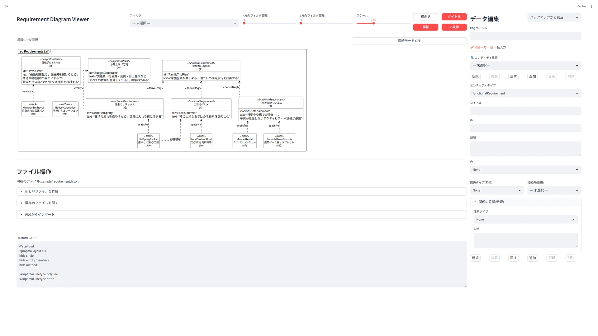
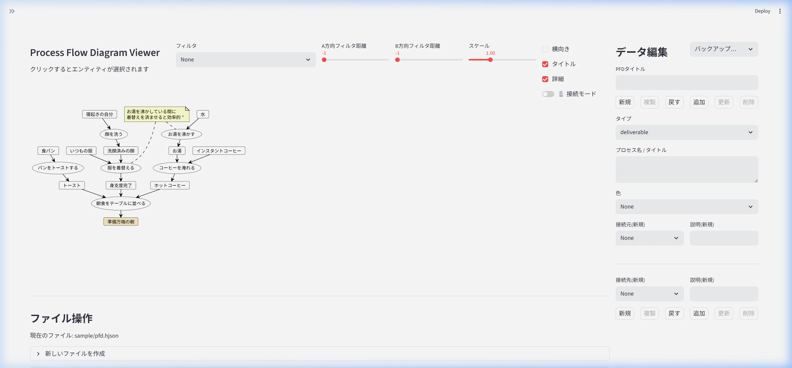
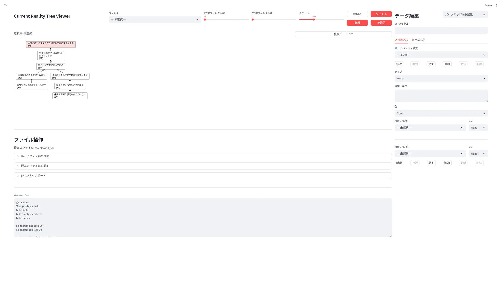
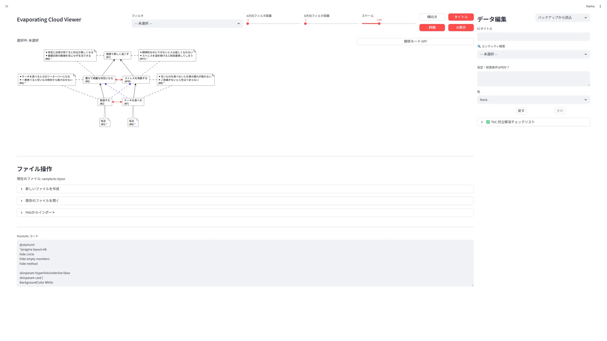
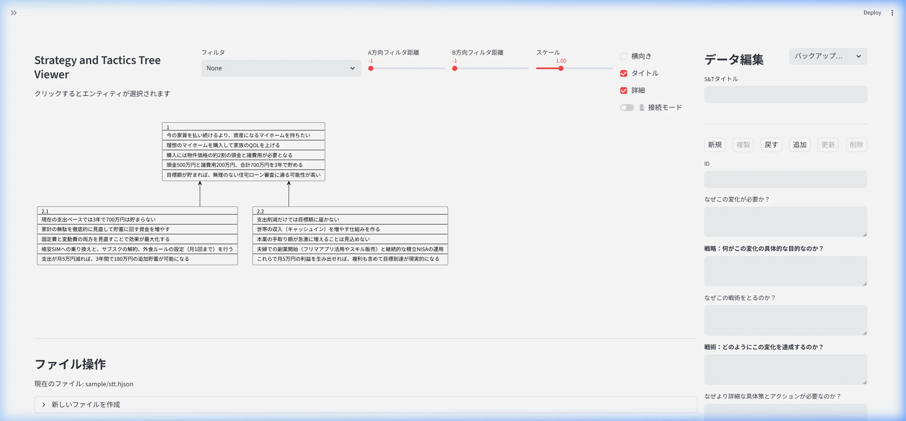
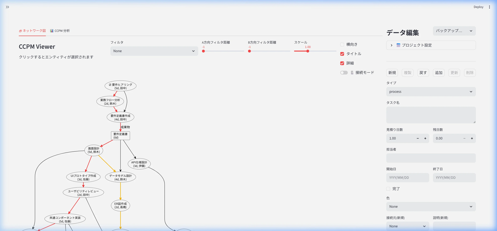
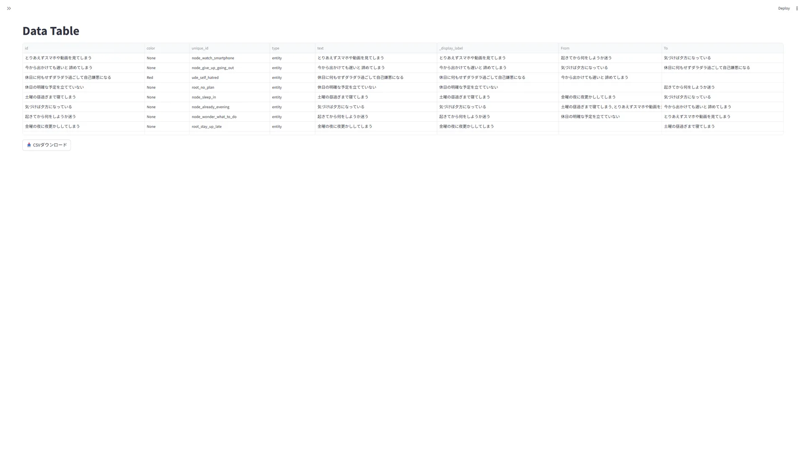
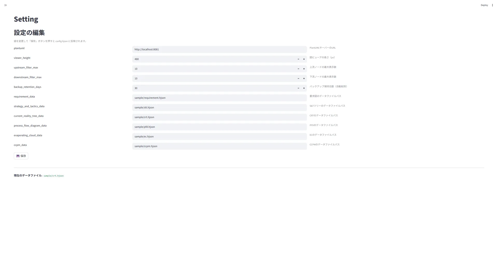

# RequirementViewer

## 概要

本ツールでは、以下の思考ツールライクなダイアグラムの表示・編集をすることができます。

| ダイアグラム | 英語名称 | 説明 |
| :--- | :--- | :--- |
| 要求図 | Requirement Diagram | 各種要件・機能間の依存関係や制約を階層的に整理する図 |
| プロセスフロー図 | Process Flow Diagram | システムや業務の処理・データ・人の流れを可視化する図 |
| 現状ツリー | Current Reality Tree | 現在起きている複数の問題（UDE）の根本原因を特定する図 |
| クラウド | Evaporating Cloud | 対立する２つの要望とその背後にある前提（ジレンマ）を解消・ブレイクスルーする図 |
| S&Tツリー | Strategy and Tactics Tree | 目標達成のための戦略（何を）と戦術（どうやって）をツリー状に展開する図 |
| CCPM | Critical Chain Project Management | リソースの競合を考慮したプロジェクト計画とバッファ管理を行うスケジュール図 |

## 環境構築

### Pythonライブラリのインストール

`uv`パッケージマネージャーを使用してインストールします。

```bash
uv sync
```

### configファイルの作成

`setting`フォルダにある`default_config.hjson`を`config.hjson`として同フォルダ内にコピーします。  
その後、`config.hjson`の各項目を設定します。

- `plantuml`
  - デフォルトでは、PlantUMLの公式サーバで処理を行います。
  - 機密情報を扱う場合には、ローカルサーバを利用するようにしてください。
- `viewer_height`
  - 画像表示部の高さを設定します。
  - ご利用の画面サイズに合わせて設定してください。
- `upstream_filter_max`, `downstream_filter_max`
  - フィルタ機能において、あるエンティティから上流・下流にいくつのエンティティを表示するかの最大値を設定します。
- `backup_retention_days`
  - バックアップファイルの保持日数を設定します（デフォルト: 30日）。
  - 指定日数を超えたバックアップは自動的に削除されます。

以下の項目はデフォルトのままで問題ありません。

- `requirement_data`
  - 要求図のデータパスを設定します。
- `current_reality_tree_data`
  - 現状ツリーのデータパスを設定します。
- `process_flow_diagram_data`
  - プロセスフロー図のデータパスを設定します。
- `evaporating_cloud_data`
  - クラウドのデータパスを設定します。
- `strategy_and_tactics_data`
  - S&Tツリーのデータパスを設定します。
- `ccpm_data`
  - CCPMのデータパスを設定します。

### PlantUMLをローカル実行する場合 (optional)

初期の状態では、PlantUMLの公式サーバで処理を行います。  
重要な情報を扱う際には、ローカルサーバを利用するようにしてください。

ローカルサーバの構築には、以下のいずれかの方法を利用します。

#### 方法1: JavaとJARファイルを利用する

1. **Javaのセットアップ**: PlantUMLの実行に`Java`が必要です。[Adoptium](https://adoptium.net/) 等からインストールしてください。
2. **PlantUMLの配置**: PlantUMLの公式サイトから`jar`ファイルを取得し、RequirementViewerフォルダ直下に`plantuml.jar`として配置します。

配置後、`config.hjson` の `plantuml` にローカルURL（例: `http://localhost:8080`）を設定するとアプリ起動時にサーバが自動起動します。

#### 方法2: Dockerを利用する（Docker環境がある場合）

既にDocker環境がある場合は、JavaやJARファイルの準備なしに以下のコマンドだけでローカルサーバを起動できます。

```bash
docker run -d -p 8080:8080 plantuml/plantuml-server:tomcat
```

起動後、設定画面（Setting）または `config.hjson` から接続先URLを `http://localhost:8080` に設定してください。

## 実行

コマンドプロンプト/ターミナルで以下のコマンドを実行してください。

```bash
uv run streamlit run app.py
```

---

## 各画面の操作

### ダイアグラム画面の共通操作（要求図 / PFD / CRT / EC / S&T / CCPM）

各ダイアグラム画面は左パネル（図の表示）と右パネル（データ編集）の2カラム構成です。

- **左パネル**: PlantUMLで描画された図が表示されます。図上のノードをクリックすると、右パネルの編集対象が切り替わります。
- **右パネル**: 選択中のエンティティの属性（名称、タイプ、色など）やエッジ（接続関係）を編集できます。上部の操作ボタンでエンティティの追加・更新・削除・複製・Undoを行います。

### 各ダイアグラム固有の特徴

| 画面 | 特徴 | 画面イメージ |
| :--- | :--- | :---: |
| 要求図 | ノードタイプが多い（Requirement / UseCase / Block 等）。エッジに関係タイプ（satisfy / refine 等）と注釈が設定可能。 | <a href="images/requirement_diagram.webp"></a> |
| PFD | ノードタイプにプロセス / 成果物 / クラウド等がある。エッジの向きは上流→下流。 | <a href="images/process_flow_diagram.webp"></a> |
| CRT | ANDノードで複数の原因を論理的にまとめられる。ノードの内容は `text` フィールドに記述。 | <a href="images/current_reality_tree.webp"></a> |
| EC | ノード構成が固定（A〜D' の5ノード）。新規追加・削除・複製は無効。更新のみ可能。 | <a href="images/evaporating_cloud.webp"></a> |
| S&T | 各ノードに「必要条件仮定」「戦略」「並行仮定」「戦術」「充分条件仮定」の5フィールドがある。 | <a href="images/strategy_and_tactics.webp"></a> |

### CCPM画面の操作



CCPM（クリティカルチェーン・プロジェクトマネジメント）画面は、他のダイアグラムと比べて設定項目が多く、以下の手順で入力を行います。

1. **プロジェクト設定**: 右パネルの「プロジェクト設定」にて、全体の開始日や休日、利用可能な担当者（リソース枠）などを登録します。開始日を設定することで、初めて左パネルにガントチャート、フィーバーチャート、タスクの優先度情報が計算・描画されるようになります。
2. **エンティティの登録**: タスク（プロセス、成果物、合流バッファなど）の名称、担当者、および工数（日数）を順次登録します。
3. **依存関係の設定**: 登録したエンティティに対し、先行・後続タスクの論理的なつながり（エッジ）を設定します。
4. **ベースラインの登録**: 計画段階が完了し、実際にプロジェクトを実行（着手）する直前に「現在のCCをベースラインに登録」を実行します。これによりフィーバーチャート等で進捗やバッファ消費率を計測するための基準点が確定します。

**ベースラインの再設定について**  
原則として、プロジェクト実行開始後にベースラインを変更することはありません。ただし、要件の根本的な見直し、大規模なタスク追加、利用可能リソース数の大幅な増減など、当初の計画の前提条件が大きく崩れた場合に限り、計画を引き直した上で再度ベースラインを登録し直すことがあります。

なお、実行中（進捗記録時）の終了予定日などを固定したい場合は、各タスクの「完了」にチェックを入れると同時に設定カレンダーの「開始日・終了日」両方を確定値として入力しておく必要があります。

### Data Table



現在のダイアグラムの全ノードデータを表形式で確認できます。各ノードの接続元（From）・接続先（To）のカラムも表示されます。CSVダウンロードボタンからデータをエクスポートできます。

### Setting



`config.hjson` の各設定項目を表形式で編集できます。各項目にはパラメータの説明が表示されます。変更後「保存」ボタンで反映されます。

---

## その他の機能

以下は画面横断で利用できる共通機能です。

### 1. 接続モード

ダイアグラム上のノードを **2回連続でクリック** すると「接続モード」に切り替わります。
この状態で別のノードをクリックすると、ノード間にエッジ（関係）を追加（既存の場合は削除）することができます。

<!-- TODO: 「接続モード」起動中であることを示す画面上部の表示や、エッジ追加の操作イメージのスクリーンショットを挿入 -->

### 2. UI上でのファイル操作

`data/` または `sample/` にある既存ファイルを選択するほか、画面上のUIから新しいファイル（.hjson）を作成し、編集対象のデータを切り替えることができます。

<!-- TODO: 右パネルにあるファイル選択・新規作成コンボボックスのスクリーンショットを挿入 -->

### 3. データ埋め込みPNGの保存とインポート

現在表示されている図のデータ（.hjson）を埋め込んだPNG画像を保存できます。
また、そのPNG画像をツールにインポートすることで、元のデータを復元できます。

### 4. PlantUMLローカルサーバの自動起動設定

ローカル環境でPlantUMLを実行する場合、`config.hjson` の `plantuml` にローカルのURL（例: `http://localhost:8080`）を設定すると、空きポートを探してバックグラウンドでローカルサーバが起動します。

### 5. バックアップと復元

各ダイアグラムの右パネルにあるセレクトボックスからバックアップファイルを選択すると、現在のデータとの差分サマリが表示されます。対応するPNG画像がある場合はサムネイルも表示されます。内容を確認してから「📥 このバックアップを復元」ボタンで復元を実行します。

### 6. エンティティの操作ボタン

各ダイアグラムの右パネルには以下の操作ボタンがあります。

| ボタン | 機能 | 有効条件 |
| :--- | :--- | :--- |
| 新規 | 空のエンティティ入力欄を表示 | 常時 |
| 複製 | 選択中のエンティティをエッジごとコピー | 既存ノード選択時 |
| 戻す | 直前の保存状態に復元（Undo） | 常時 |
| 追加 | 入力内容を新規エンティティとして保存 | 新規作成時 |
| 更新 | 選択中のエンティティを上書き保存 | 既存ノード選択時 |
| 削除 | 選択中のエンティティを削除 | 既存ノード選択時 |

※ EC（クラウド）はノード構成が固定のため、複製ボタンは無効です。

